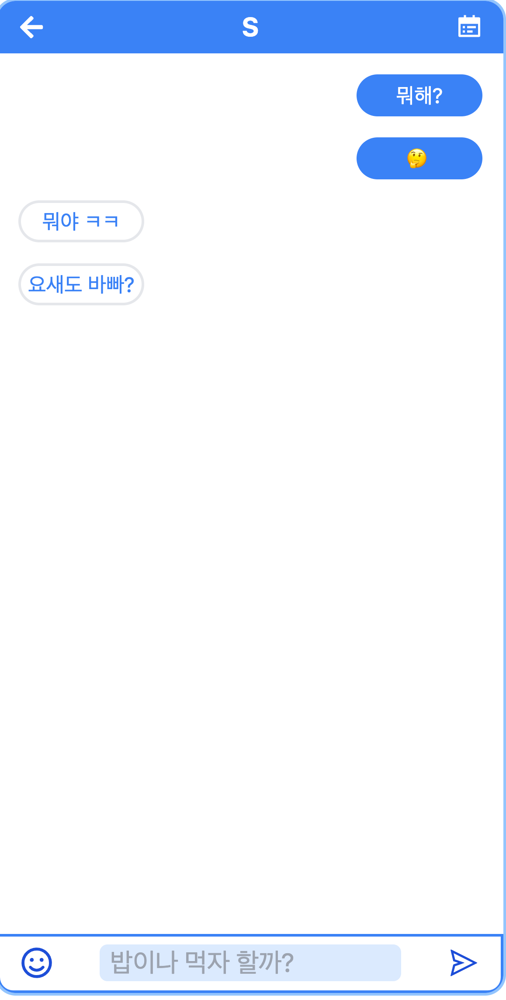

## 블루밍

> IU - Blueming의 가사대로 체험해 볼 수 있는 페이지 입니다

서로 대화를 주고 받는 듯한 연출을 했으며,

TODO 만들기와, 현재 자신의 위치를 볼 수 있습니다.



## 설치 방법

```
npm install
```

## 사용 예제

```
npm run dev
```

로 실행합니다

## 업데이트 내역

- 1.0.1
  - Ver1 완성
- 1.1.0
  - 추가: 로딩 시간 추가하고 마지막에 오디오 스펙트럼 추가했습니다.
